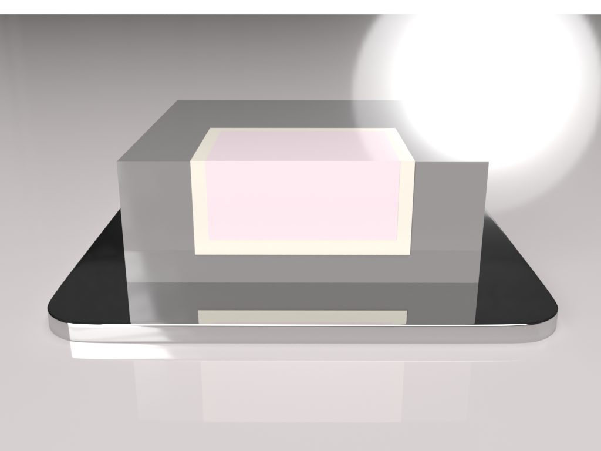

# TCAD-Simulation-Bipolar-Junction-Transistor-BJT-
<h1>Simulate BJT with Silvaco Athena/Atlas.</h1>

BJT 3D modeling

BJT 2D structure

BJT current density

BJT electric field

BJT collector current vs voltage

